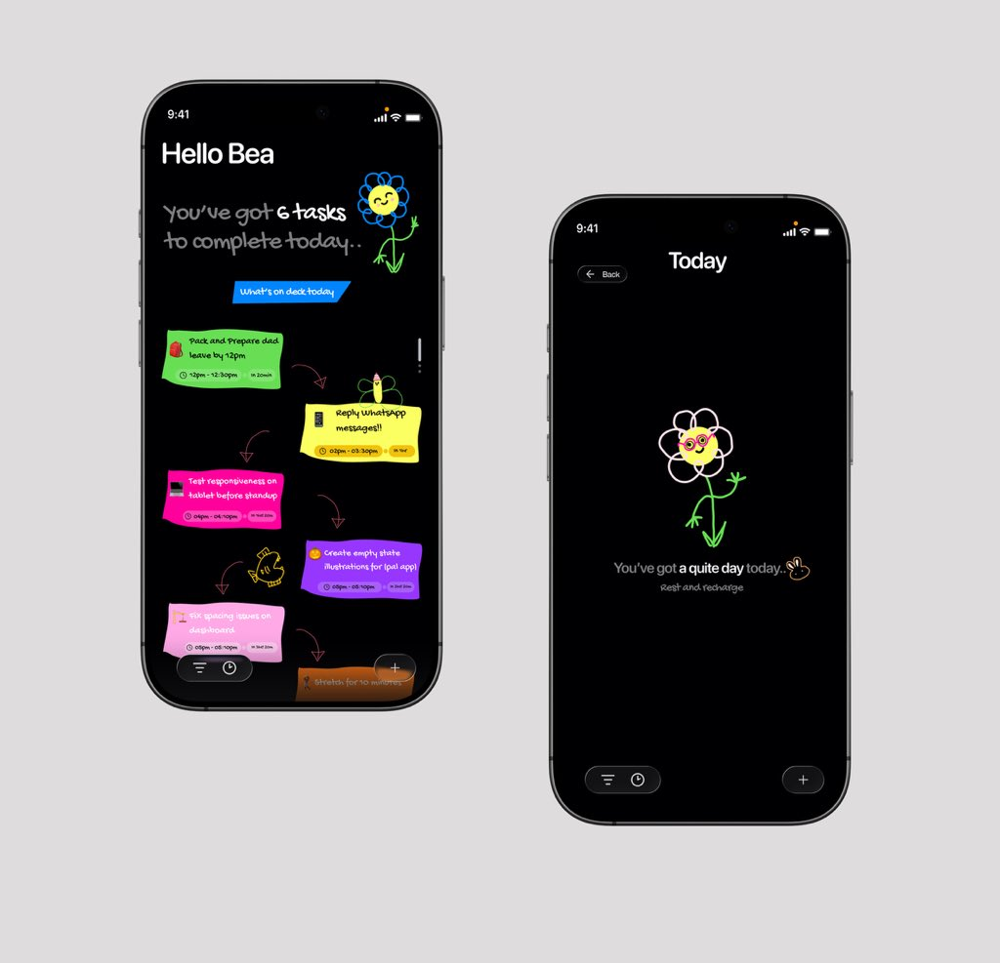
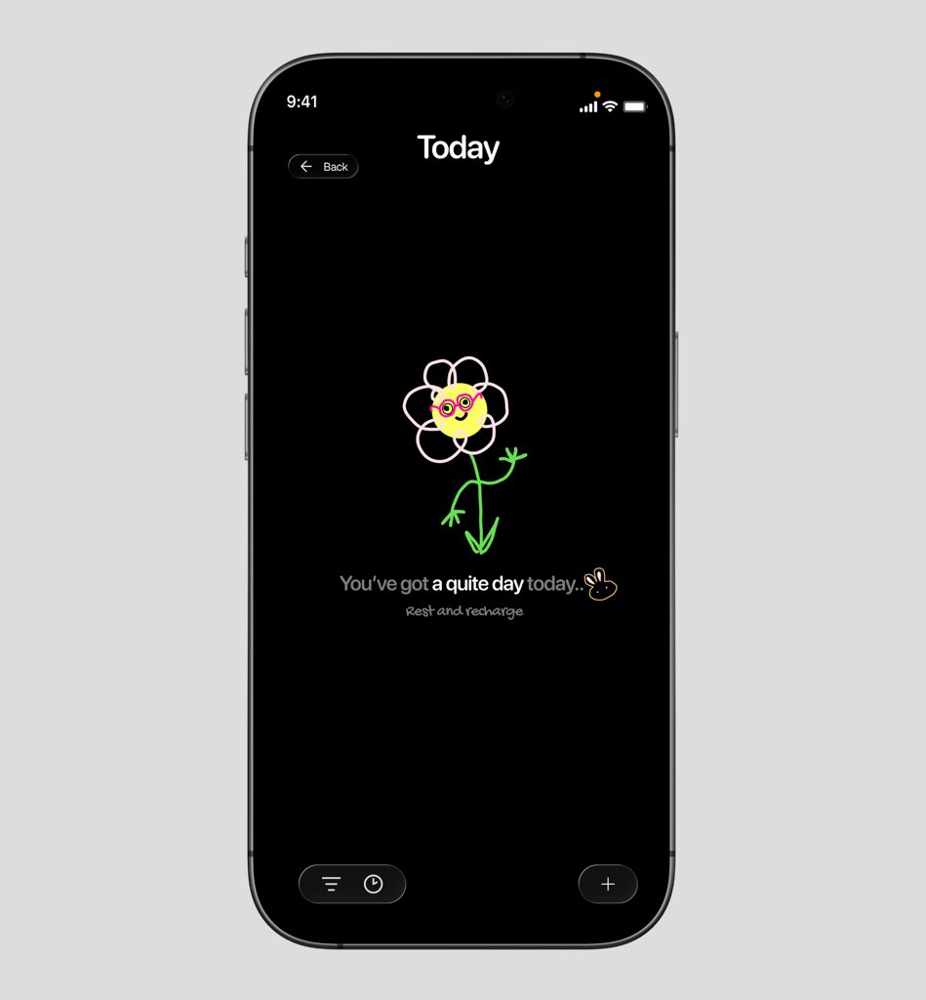

# Bea 🦋

**A productivity app that doesn’t stress you out.**

Bea is a fluid, interactive productivity canvas designed to make task management feel natural, engaging, and beautiful. Built with Flutter, it features a "liquid glass" aesthetic, hand-drawn elements, and a dynamic zigzag layout that prioritizes visual flow and ease of use.

## Inspiration

This project was inspired by the stunning design concept from **DesignBea (@Ui_meesha)**:

> "Finally. A productivity app that doesn’t stress you out.."
> — [DesignBea on Twitter](https://twitter.com/Ui_meesha/status/1787123955685822838)

## Key Features

- **Dynamic Task Canvas**: Drag and rearrange tasks with fluid, squiggly connectors that dynamically re-anchor to the nearest edge.
- **Zigzag Layout**: A unique staggered task flow that creates a natural reading rhythm and a sense of progression.
- **Liquid Glass Aesthetic**: Premium frosted glass effects, real-time background blurs, and a curated "dark mode" palette.
- **Hand-Drawn Charm**: Custom-painted wobbly sticky notes and bubbly typography using Google Fonts (**Fredoka** & **Patrick Hand**).
- **Seamless Creation**: A high-fidelity "Add Task" page featuring interactive color pickers and hand-drawn icon selection.
- **Smart Stacking**: Intelligent z-index management that brings the task you're interacting with to the front of the deck.

## 🛠 Tech Stack

- **Framework**: [Flutter](https://flutter.dev/)
- **State Management**: [GetX](https://pub.dev/packages/get)
- **Navigation**: GetX Routing
- **Aesthetics**: 
  - Custom `CustomClipper` for parallelogram headers.
  - Custom `CustomPainter` for hand-drawn wobbly sticky notes.
  - Bezier-based `SquigglyArrow` connectors.

## Gallery

  
  

---

Inspired by the creative vision of [DesignBea](https://twitter.com/Ui_meesha).
